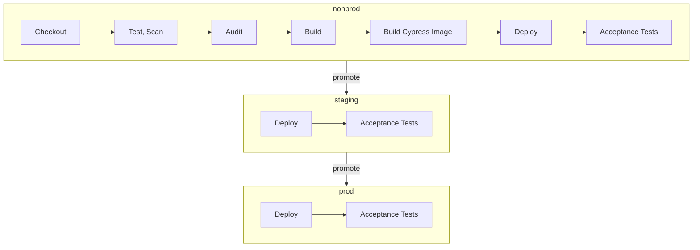

# <<[(ds "config").agency_name]>> <<[(ds "config").project_name]>> <<[(ds "config").service_name]>>

Repository for the USCIS Accounts Public technical challenge UI application

## Running the Web application

In the root directory run the following commands and navigate to `http://localhost:3000`

1. `npm i`
2. `npm start`

---

## Production Ready Build

In the root directory run the following command to run a production-ready build of the application

1. `npm run build`

A production bundle of the application will be built to `build/`

---

### Running the test suite for the web application

Run your preferred test command:

- `npm run test` for running the test suite and watching for changes
- `npm run test-once` for running the test suite without watching
- `npm run test-cov` to output coverage

---

## End-To-End testing

### Overview

End-To-End testing is accomplished using Cypress.

Cypress runs end-to-end tests the same way users interact with your app by using a real browser, visiting URLs, viewing content, clicking on links and buttons, etc.
Testing this way helps ensure your tests and the user's experience are the same.

Cypress tests are located in the `cypress/e2e` directory. Cypress fixture files (static data to be used by tests) are located in the `cypress/fixtures` directory.
Additional documentation about Cypress can be found at https://docs.cypress.io/guides/end-to-end-testing/testing-your-app

### Running Cypress tests

Before running Cypress tests, ensure the web application is running (`npm start`) and that the `REACT_APP_CYPRESS_BASE_URL` environment variable is set to the running application (typically `http://localhost:3000`). In addition, at the root level, copy the `cypress.sample.env.json` file into a `cypress.env.json` file and populate the json values.

Cypress tests can be run in 3 ways:

- `npm run cy:run:local` for running the tests and viewing the results directly in the command line

To view cypress test results with Allure (visualizations), install Allure with `npm install -g allure-commandline`, then run tests with `allure` as true in your cypress.env.json, and finally run `allure serve`.

As a post-deployment activity, the functional test suite will run with Cypress against non-prod, staging, and prod. Tests that include a write functionality or altering of datas should be tagged with the `WRITE`tag so that Jenkins can selectively run them against the deployed environments.For example, `production` should not execute any tests that perform write opertations. Please reference the `Jenkinsfile` for more context.

Example of adding optional tags list to Cypress test commands:

```
    it([Tag.WRITE], 'A test that does something', () => {
       ...
     });
```

Tests can be tagged with the following tag(s): WRITE

---

## Pipeline

The following gantt diagram outlines the [Jenkins Pipeline](https://jenkins.acuityap.com/). The Y axis indicates the enivornments and the X axis indicates the number of stages.



---

## CDK backend for Challenge Frontend (`cdk/`)
